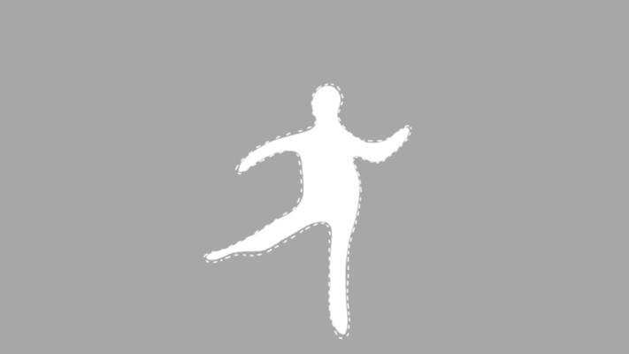
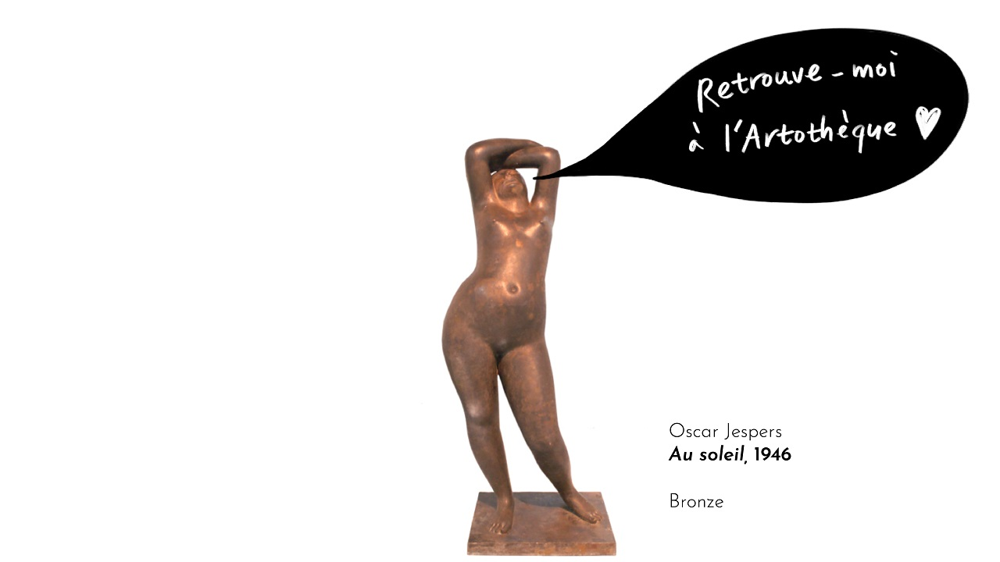
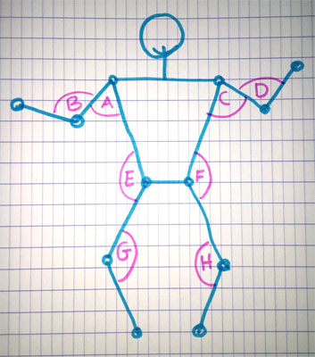

# MonsConnect

[English version below](#anchors-in-markdown)


Ce projet a été créé lors de l'édition 2019 de Museomix, et plus particlièrement au BAM, à Mons, en Belgique (qui fait partie Pôle Muséal de la Ville, qui compte 11 sites en tout).

## Terrain de jeu

"IN & OUT", réconcilier le musée et la ville, la rue, l'extérieur en général

## Oeuvre(s) sélectionnée(e)s

Le BAM acceuillant en novembre 2018 une exposition de Niki de Saint Phalle, il a été décidé d'utiliser l'oeuvre "Les Baigneurs" comme sujet de notre prototype.


## Idée de base

Permettre, hors du musée (dans la rue, à un arrêt de bus, etc) à une personne de s'identifier à une œuvre existante, en prenant la pose de celle-ci (sans savoir à quoi la forme correspond) et à ensuite découvrir l'œuvre et son emplacement.


## Idée après évolution

Réaliser un faux arrêt de bus, avec projection et détection de mouvement.

Le scénario de base était le suivant :

- un(e) passant(e) se promène devant l'arrêt de bus et voit une image bouger sur le fond de l'arrêt de bus
- en se positionnant devant, il ou elle se rend compte que c'est sa silhouette simplifiée qui est affichée
- en essayant via ses mouvements de coller à la forme du pochoir présent à l'écran, la personne "gagne" et il lui est indiqué à quelle œuvre il ou elle a ressemblé, et dans quel musée la trouver
- le "jeu" se relance, avec une autre œuvre

## Quelques visuels

| **Masque indiquant la forme à reproduire** |                **Exemple d'écran de fin**                |
| :----------------------------------------: | :------------------------------------------------------: |
|              |  |

## Matériel

- Kinect v1 (modèle 1414)
- Vidéo-projecteur
- Webcam

## Environnement logiciel

- [Processing 2.21](https://processing.org/download/)
- Drivers Kinect v1
  - [Windows](https://www.microsoft.com/en-us/download/details.aspx?id=40278)
  - [OS X](http://blog.nelga.com/setup-microsoft-kinect-on-mac-os-x-10-9-mavericks/)
  - [Linux](https://github.com/shiffman/OpenKinect-for-Processing)

## Principe technique

La Kinect pouvant mesurer les angles entre les parties du corps, l'équipe a constitué une banque de coordonnées pour les différentes œuvres.

La nomenclature des angles est la suivante :



Le stockage se fait sous forme d'un fichier JSON ayant le format suivant :

```json
{"characters": [
      {
        "angles": {
			"a" : 80,
			"b" : 150,
			"c" : 80,
			"d" : 130,
			"e" : 140,
			"f" : 180,
			"g" : 160,
			"h" : 180,
        },
        "name": "Les baigneurs",
		"maskFile" : "masks/1pochoir",
		"endFile" : "ends/ecrandefin-01"
      }
]}
```

A chaque boucle réalisée par Processing, on vérifie via la fonction `checkAngles()`si chaque angle mesuré via la Kinect correspond à l'angle indiqué dans une des oeuvres (avec une grosse marge d'erreur vu la résolution de l'appareil), et si oui, on affiche alors le fichier de "fin" correspondant.

## Utilisation

* ouvrir le fichier **MonsConnect.pde** dans *Processing*
* utiliser le raccourci Ctrl + R pour lancer le projet

